# prd-to-jira

A [Claude Code Skill](https://docs.claude.com/en/docs/claude-code/skills) that turns a
PRD into a Jira-ready backlog: epics, stories/tasks, cross-team dependencies, and
Fibonacci story-point estimates — plus a rendered dependency graph and a
review-ready backlog doc.

## The problem

Turning a PRD into a scoped, estimated, dependency-aware backlog is a couple of hours
of manual TPM/EM work per PRD — and it's exactly the kind of structured-extraction-plus-
judgment task an LLM is good at, if you give it a rubric instead of "just wing it."

## What it does

1. You hand Claude a PRD (Markdown or plain text) inside Claude Code.
2. Claude reads it and, following the rubric in [`skill/SKILL.md`](skill/SKILL.md),
   extracts epics → tasks, maps dependencies between tasks (sequential build order,
   shared foundations, explicit PRD ordering, cross-team handoffs), and estimates each
   task on a 1-13 Fibonacci scale based on scope + uncertainty — flagging anything
   that would be a 13 as needing a spike instead of a guess.
3. That extraction is written to one `epics.json` file.
4. A small deterministic script, [`skill/scripts/render_outputs.py`](skill/scripts/render_outputs.py),
   turns `epics.json` into:
   - `jira_import.csv` — ready for Jira's CSV importer
   - `dependencies.mmd` / `dependencies.md` — a Mermaid dependency graph, color-coded
     by risk, plus the manual issue-linking steps (Jira's CSV import can't create
     issue links on first import, since ticket keys don't exist yet)
   - `backlog.md` — the full backlog as a readable doc, useful in a PRD review before
     anyone touches Jira

The split matters: the model does the judgment call (what's an epic, what depends on
what, how risky/uncertain is this), and plain code does the mechanical formatting —
so the CSV/diagram/doc are always structurally consistent, and re-rendering after a
tweak to `epics.json` is instant and free.

## Demo

The [`examples/`](examples/) directory contains a full worked example — a fictional
PRD for a "multi-currency expenses + delegate approvals" feature — run end-to-end:

- Input: [`examples/sample-prd.md`](examples/sample-prd.md)
- Output: [`examples/output/`](examples/output/) (`epics.json`, `jira_import.csv`,
  `dependencies.md`, `backlog.md`)

Result: **5 epics, 23 tasks, 78 story points, 4 tasks flagged high-risk** (a
cross-team FX integration, a foundational routing refactor, and two tasks gated on an
open compliance question the PRD itself left unresolved).

The dependency graph, generated straight from `dependencies.mmd`:

```mermaid
graph TD
  subgraph EPIC-1 ["Multi-currency expense submission & display"]
    EPIC-1-1["Extend expense data model & API (5pt)"]
    EPIC-1-2["Integrate FX rate service (5pt)"]
    EPIC-1-3["Async conversion fallback (5pt)"]
    EPIC-1-4["Web currency selector (3pt)"]
    EPIC-1-5["Mobile currency selector (3pt)"]
    EPIC-1-6["Web: show original+converted (2pt)"]
    EPIC-1-7["Mobile: show original+converted (2pt)"]
    EPIC-1-8["Approve pre-conversion (3pt)"]
  end
  subgraph EPIC-2 ["Shared approval-resolution & delegate setup"]
    EPIC-2-1["Shared approval-resolution service (8pt)"]
    EPIC-2-2["Approver UI: pick delegate + dates (3pt)"]
    EPIC-2-3["Delegation records + auto-expiry (5pt)"]
    EPIC-2-4["Delegate sees delegated-from queue (3pt)"]
    EPIC-2-5["Record delegate + authority on approval (3pt)"]
  end
  subgraph EPIC-3 ["Delegate notifications & audit trail"]
    EPIC-3-1["Extend audit schema (3pt)"]
    EPIC-3-2["Write delegated-approval audit entries (2pt)"]
    EPIC-3-3["Audit log filter/search (3pt)"]
    EPIC-3-4["Notification lifecycle events (5pt)"]
  end
  subgraph EPIC-4 ["Admin controls for rollout"]
    EPIC-4-1["Admin: multi-currency settings (3pt)"]
    EPIC-4-2["Admin: active delegations list (2pt)"]
    EPIC-4-3["Independent feature flags (2pt)"]
  end
  subgraph EPIC-5 ["Finance reporting export updates"]
    EPIC-5-1["Add original+converted columns (3pt)"]
    EPIC-5-2["Spike: confirm attribution rule (2pt)"]
    EPIC-5-3["Update export attribution logic (3pt)"]
  end
  EPIC-1-1 --> EPIC-1-2
  EPIC-1-2 --> EPIC-1-3
  EPIC-1-1 --> EPIC-1-4
  EPIC-1-1 --> EPIC-1-5
  EPIC-1-2 --> EPIC-1-6
  EPIC-1-2 --> EPIC-1-7
  EPIC-1-3 --> EPIC-1-8
  EPIC-2-1 --> EPIC-2-2
  EPIC-2-1 --> EPIC-2-3
  EPIC-2-1 --> EPIC-2-4
  EPIC-2-3 --> EPIC-2-4
  EPIC-2-1 --> EPIC-2-5
  EPIC-2-1 --> EPIC-3-1
  EPIC-3-1 --> EPIC-3-2
  EPIC-2-5 --> EPIC-3-2
  EPIC-3-2 --> EPIC-3-3
  EPIC-2-3 --> EPIC-3-4
  EPIC-1-1 --> EPIC-4-1
  EPIC-2-3 --> EPIC-4-2
  EPIC-1-2 --> EPIC-5-1
  EPIC-5-2 --> EPIC-5-3
  EPIC-3-2 --> EPIC-5-3
  classDef riskHigh fill:#f8d7da,stroke:#c0392b,color:#611a15;
  classDef riskMedium fill:#fff3cd,stroke:#b8860b,color:#664d03;
  classDef riskLow fill:#d4edda,stroke:#2e7d32,color:#1e4620;
  class EPIC-1-2,EPIC-2-1,EPIC-5-2,EPIC-5-3 riskHigh;
  class EPIC-1-1,EPIC-1-3,EPIC-1-8,EPIC-2-3,EPIC-2-5,EPIC-3-1,EPIC-3-4 riskMedium;
  class EPIC-1-4,EPIC-1-5,EPIC-1-6,EPIC-1-7,EPIC-2-2,EPIC-2-4,EPIC-3-2,EPIC-3-3,EPIC-4-1,EPIC-4-2,EPIC-4-3,EPIC-5-1 riskLow;
```

## Using it

1. Copy `skill/` into your Claude Code skills directory (project-level:
   `.claude/skills/prd-to-jira/`, or user-level: `~/.claude/skills/prd-to-jira/`).
2. In Claude Code, give it a PRD and ask it to break the work down — e.g. "turn
   `docs/my-feature-prd.md` into a Jira backlog." The skill's description is written
   to trigger automatically on that kind of request; the `/prd-to-jira` slash form
   also works if invoked explicitly.
3. Claude writes `epics.json`, then runs `render_outputs.py` to produce the CSV,
   dependency graph, and backlog doc.
4. Import `jira_import.csv` into Jira, then use `dependencies.md` to add the "is
   blocked by" links by hand (Jira's importer can't create links to issues that don't
   have keys yet).

Requires only Python 3 (stdlib only, no dependencies) for the render step.

## Design notes

- **Extraction estimation is a rubric, not a formula.** `SKILL.md` gives Claude a
  scope-and-uncertainty table for story points rather than a hard-coded scoring
  algorithm, because "how risky is this" is a judgment call a PRD's prose doesn't
  reduce to a formula — that's the actual TPM skill being automated here.
- **Dependencies are direct, not transitive.** The skill records only direct
  `depends_on` edges; a downstream critical-path/scheduling tool is expected to
  compute the transitive closure — see
  [`critical-path-mapper`](https://github.com/pshah19/critical-path-mapper), which
  consumes this skill's output directly.
- **The renderer validates what the model can't guarantee.** `render_outputs.py`
  rejects any `epics.json` where a `depends_on` id doesn't resolve to a real task, so
  a malformed extraction fails loudly instead of producing a broken CSV.

## License

MIT — see [LICENSE](LICENSE).
